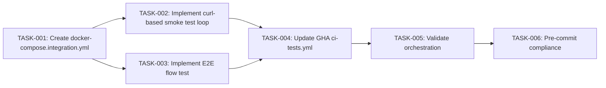

# Plan — 5-Stage GitOps-Aligned Engineering Lifecycle Pipeline

**Issue:** Issue 11
**Estimate:** 2 sessions (4-6hrs)
**DORA Capability:** AI Capability 7 (Quality internal platforms)

## Task DAG

## Task Summary

| Task     | Title                                 | Agent  | Est. Lines | Deps         |
| -------- | ------------------------------------- | ------ | ---------- | ------------ |
| TASK-001 | Create docker-compose.integration.yml | build  | 35         | —            |
| TASK-002 | Implement curl-based smoke test loop  | build  | 25         | TASK-001     |
| TASK-003 | Implement E2E flow test               | test   | 60         | TASK-001     |
| TASK-004 | Update GHA ci-tests.yml               | build  | 80         | TASK-002,003 |
| TASK-005 | Validate GHA orchestration            | review | 10         | TASK-004     |
| TASK-006 | Pre-commit compliance validation      | build  | 5          | TASK-004,005 |

**Total:** 6 tasks, ~215 estimated lines
**Critical path:** TASK-001 → TASK-003 → TASK-004 → TASK-005 → TASK-006
